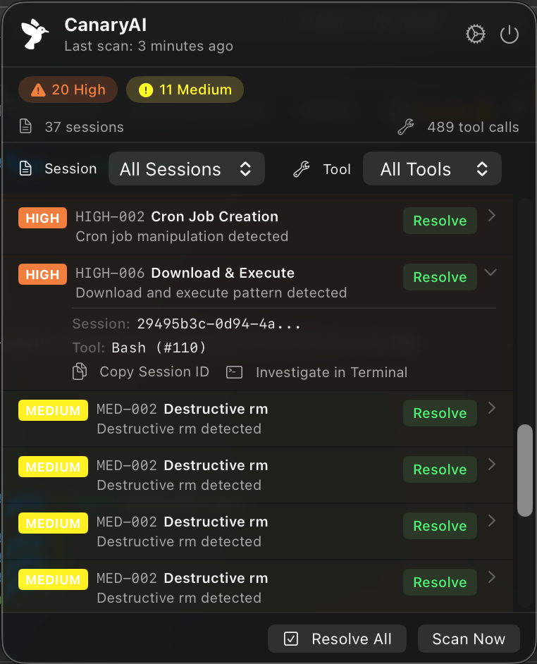

<p align="center">
  
</p>

<h1 align="center">CanaryAI</h1>

<p align="center">
  Monitor your AI coding agents for suspicious behaviour.
</p>

<p align="center">
  
  
  
</p>

---

## What is CanaryAI?

AI coding agents are powerful — but they run real commands on your machine. CanaryAI watches what they do and alerts you when something looks off: reverse shells, credential theft, persistence mechanisms, data exfiltration, and more.

It works by scanning [Claude Code](https://claude.ai/code) session logs in real time, applying a set of detection rules, and surfacing alerts in a native macOS menu bar app.

> **Alert-only.** CanaryAI never blocks or interferes with your agent. It observes and reports.

---

## Screenshot

<p align="center">
  
</p>

---

## Install

### Option 1 — Homebrew

```bash
brew tap jx887/canaryai
brew install --cask canaryai
```

Installs the CanaryAI menu bar app and the `canaryai` CLI command. Everything in one step.

### Option 2 — DMG

Download `CanaryAI.dmg` from [Releases](https://github.com/jx887/homebrew-canaryai/releases), open it, and drag CanaryAI to Applications.

Self-contained — includes the CLI, no other installs needed.

### First Launch (both options)

CanaryAI is not code-signed, so macOS may block it on first launch. If you see a warning:

1. Open **System Settings → Privacy & Security**
2. Scroll down to the Security section
3. Click **Open Anyway** next to CanaryAI
4. Click **Open** to confirm

Or run this once in Terminal:

```bash
xattr -dr com.apple.quarantine /Applications/CanaryAI.app
```

**Launch at Login:** CanaryAI enables this by default. macOS requires a one-time approval — open **System Settings → General → Login Items** and confirm CanaryAI is listed.

---

## Usage

```bash
# Scan sessions from the last 24 hours (default)
canaryai scan

# Scan all sessions
canaryai scan --all

# Scan a specific project
canaryai scan --project ~/Developer/myapp

# Scan a specific time window
canaryai scan --since 7d

# Filter by minimum severity
canaryai scan --severity high

# JSON output
canaryai scan --json

# List all loaded detection rules
canaryai rules list
```

Exit codes: `0` = clean, `1` = alerts found.

The macOS app provides the same scanning via a menu bar UI — available via both install options above.

---

## Detection Rules

CanaryAI ships with **30+ built-in rules** across seven categories. Severity levels: `CRITICAL` → `HIGH` → `MEDIUM` → `LOW`.

### Commands
Dangerous shell commands executed by the agent.

| ID | Severity | Rule |
|----|----------|------|
| CRIT-001 | CRITICAL | Reverse Shell — `/dev/tcp`, `socat EXEC`, `nc -e`, etc. |
| HIGH-002 | HIGH | Cron Job Creation — persistence via crontab |
| HIGH-005 | HIGH | SSH Tunnel — port forwarding (`-L`, `-R`, `-D`) |
| HIGH-203 | HIGH | History Tampering — clearing shell history to cover tracks |
| MED-001 | MEDIUM | sudo Usage — privilege escalation |
| MED-002 | MEDIUM | Destructive rm — recursive deletion of system directories |
| MED-003 | MEDIUM | Dangerous chmod — world-writable or setuid permissions |
| MED-004 | MEDIUM | Package Installation — pip, npm, brew, gem, cargo |
| MED-203 | MEDIUM | Hosts File Modification — DNS hijacking via `/etc/hosts` |

### Exfiltration
Data being read and sent out of your machine.

| ID | Severity | Rule |
|----|----------|------|
| CRIT-002 | CRITICAL | SSH Key Exfiltration — reading `~/.ssh/id_*` then network call |
| CRIT-003 | CRITICAL | Credential Theft — reading credential file then curl/wget |
| CRIT-004 | CRITICAL | Encoded Data Exfil — base64/hex piped to curl/wget/nc |
| HIGH-004 | HIGH | Suspicious POST — curl/wget with data to external host |
| HIGH-205 | HIGH | Webhook Exfiltration — data sent to webhook.site, pipedream, etc. |
| LOW-001 | LOW | .env File Read — access to environment variable files |
| LOW-002 | LOW | Credential File Read — `.pem`, `.key`, AWS credentials, kubeconfig |

### Backdoor & Persistence
Attempts to survive beyond the current session.

| ID | Severity | Rule |
|----|----------|------|
| HIGH-001 | HIGH | LaunchAgent/Daemon — macOS persistent service creation |
| HIGH-003 | HIGH | Shell Profile Mod — writing to `.zshrc`, `.bashrc`, etc. |
| HIGH-006 | HIGH | Download & Execute — `curl \| bash`, `wget \| sh` |
| HIGH-204 | HIGH | Git Hook Write — modifying `.git/hooks/` to persist across commits |
| MED-204 | MEDIUM | SSH Config Modification — ProxyCommand backdoors |

### Reconnaissance
Probing for credentials and sensitive information.

| ID | Severity | Rule |
|----|----------|------|
| MED-005 | MEDIUM | Git Credential Access — `.git-credentials`, `.netrc`, `.npmrc` |
| MED-205 | MEDIUM | Password Manager CLI — 1Password, Bitwarden, rbw |
| LOW-003 | LOW | Sensitive Search — grep for passwords, tokens, secrets |
| LOW-004 | LOW | MCP Tool Usage — external MCP tool invocations |

### Network
Network scanning and DNS reconnaissance.

| ID | Severity | Rule |
|----|----------|------|
| MED-102 | MEDIUM | Network Port Scan — nmap, masscan, nc -z |
| LOW-101 | LOW | DNS Lookup — dig, nslookup, host |

### macOS
macOS-specific credential and data access.

| ID | Severity | Rule |
|----|----------|------|
| HIGH-201 | HIGH | Keychain Access — dumping or exporting Keychain entries |
| HIGH-202 | HIGH | Browser Data Access — Chrome, Firefox, Safari login databases |

### Docker
Container privilege escalation.

| ID | Severity | Rule |
|----|----------|------|
| HIGH-101 | HIGH | Privileged Container — `--privileged`, `SYS_ADMIN`, host mounts |
| MED-101 | MEDIUM | Docker Socket Exposure — mounting `/var/run/docker.sock` |

---

## Adding Custom Rules

Rules are plain YAML files. Drop one in `~/.config/canaryai/rules/` and it loads automatically — no restart needed.

```yaml
- id: CUSTOM-001
  name: My Rule
  severity: HIGH
  tools: [Bash]
  match:
    - field: command
      patterns:
        - "suspicious_pattern"
  message: "Describe what was detected"
  tags: [custom]
```

```bash
canaryai rules list   # verify it loaded
```

See [`canaryai/src/canaryai/rules/builtin/CONTRIBUTING.md`](canaryai/src/canaryai/rules/builtin/CONTRIBUTING.md) for the full field reference.

---

## Contributing

Contributions are welcome — especially new detection rules.

### Adding a Rule

1. Fork the repo
2. Add a `.yaml` file to `canaryai/src/canaryai/rules/builtin/`
3. Test it: `canaryai rules list`
4. Open a pull request describing what the rule detects and why it's suspicious

### Reporting a Bug or False Positive

Open an [issue](https://github.com/jx887/homebrew-canaryai/issues) with:
- The rule ID that fired
- What the agent was actually doing
- Your Claude Code version

### Building Locally

```bash
# Python CLI
cd canaryai && pip install -e .
canaryai --version

# macOS app (debug)
cd CanaryAIApp && swift build

# macOS app (release + DMG)
cd CanaryAIApp && ./build.sh
```

---

## Supported AI Agents

| Agent | Supported |
|-------|-----------|
| Claude Code | ✅ |
| Codex | ❌ |
| Gemini | ❌ |
| GitHub Copilot | ❌ |

Support for additional agents is planned. PRs welcome.

---

## Upcoming Features

- **Whitelist / Trust** — Mark specific commands or rules as trusted to suppress future false positives
- **Real-time Watch Mode** — Instant detection using filesystem events instead of polling

---

## Privacy

CanaryAI runs entirely on your machine with no analytics or telemetry. The only network call it makes is polling the GitHub releases API every 60 seconds to check for a newer version.

---

## License

MIT — see [LICENSE](LICENSE).

**Contact:** [jonx.global@gmail.com](mailto:jonx.global@gmail.com)
